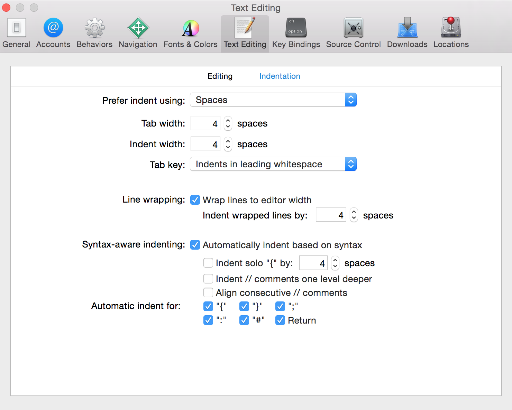

# Swift Style Guide

## Сontents

* [Naming](#naming)
* [Spacing](#spacing)
* [Comments](#comments)
* [Protocol Conformance](#protocol-conformance)
* [Computed Properties](#computed-properties)
* [Types](#types)
  * [Constants](#constants)
  * [Optionals](#optionals)
* [Type Inference](#type-inference)
* [Syntactic Sugar](#syntactic-sugar)
* [Copyright Statement](#Copyright Statement)

## Naming

Use descriptive names with camel case for classes, methods, variables, etc. Class names should be capitalized, while method names and variables should start with a lower case letter.

**Preferred:**

```swift
private let maximumWidgetCount = 100

class WidgetContainer {
  var widgetButton: UIButton
  let widgetHeightPercentage = 0.85
}
```

**Not Preferred:**

```swift
let MAX_WIDGET_COUNT = 100

class app_widgetContainer {
  var wBut: UIButton
  let wHeightPct = 0.85
}
```

For functions and init methods, prefer named parameters for all arguments unless the context is very clear. Include external parameter names if it makes function calls more readable.

```swift
func dateFromString(dateString: String) -> NSDate
func convertPointAt(column column: Int, row: Int) -> CGPoint
func timedAction(delay delay: NSTimeInterval, perform action:SAction) -> Action!

// would be called like this:
dateFromString("2014-03-14")
convertPointAt(column: 42, row: 13)
timedAction(delay: 1.0, perform: someOtherAction)
```

For methods, follow the standard Apple convention of referring to the first parameter in the method name:

```swift
class Guideline {
  func combineWithString(incoming: String, options: Dictionary?) { ... }
  func upvoteBy(amount: Int) { ... }
}
```

## Spacing

* Indent using 2 spaces rather than tabs to conserve space and help prevent line wrapping. Be sure to set this preference in Xcode as shown below:

  

* Method braces and other braces (`if`/`else`/`switch`/`while` etc.) always open on the same line as the statement but close on a new line.
* Tip: You can re-indent by selecting some code (or ⌘A to select all) and then Control-I (or Editor\Structure\Re-Indent in the menu). Some of the Xcode template code will have 4-space tabs hard coded, so this is a good way to fix that.

**Preferred:**
```swift
if user.isHappy {
  // Do something
} else {
  // Do something else
}
```

**Not Preferred:**
```swift
if user.isHappy
{
    // Do something
}
else {
    // Do something else
}
```

* There should be exactly one blank line between methods to aid in visual clarity and organization. Whitespace within methods should separate functionality, but having too many sections in a method often means you should refactor into several methods.

## Comments

When they are needed, use comments to explain **why** a particular piece of code does something. Comments must be kept up-to-date or deleted.

Avoid block comments inline with code, as the code should be as self-documenting as possible. *Exception: This does not apply to those comments used to generate documentation.*


## Protocol Conformance

When adding protocol conformance to a class, prefer adding a separate class extension for the protocol methods. This keeps the related methods grouped together with the protocol and can simplify instructions to add a protocol to a class with its associated methods.

Also, don't forget the `// MARK: -` comment to keep things well-organized!

**Preferred:**
```swift
class MyViewcontroller: UIViewController {
  // class stuff here
}

// MARK: - UITableViewDataSource
extension MyViewcontroller: UITableViewDataSource {
  // table view data source methods
}

// MARK: - UIScrollViewDelegate
extension MyViewcontroller: UIScrollViewDelegate {
  // scroll view delegate methods
}
```

**Not Preferred:**
```swift
class MyViewcontroller: UIViewController, UITableViewDataSource, UIScrollViewDelegate {
  // all methods
}
```

## Computed Properties

For conciseness, if a computed property is read-only, omit the get clause. The get clause is required only when a set clause is provided.

**Preferred:**
```swift
var diameter: Double {
  return radius * 2
}
```

**Not Preferred:**
```swift
var diameter: Double {
  get {
    return radius * 2
  }
}
```
## Types

Always use Swift's native types when available. Swift offers bridging to Objective-C so you can still use the full set of methods as needed.

**Preferred:**
```swift
let width = 120.0                                    // Double
let widthString = (width as NSNumber).stringValue    // String
```

**Not Preferred:**
```swift
let width: NSNumber = 120.0                          // NSNumber
let widthString: NSString = width.stringValue        // NSString
```

In Sprite Kit code, use `CGFloat` if it makes the code more succinct by avoiding too many conversions.

### Constants

Constants are defined using the `let` keyword, and variables with the `var` keyword. Always use `let` instead of `var` if the value of the variable will not change.

**Tip:** A good technique is to define everything using `let` and only change it to `var` if the compiler complains!

### Optionals

For optional binding, shadow the original name when appropriate rather than using names like `unwrappedView` or `actualLabel`.

**Preferred:**
```swift
var subview: UIView?
var volume: Double?

// later on...
if let subview = subview, volume = volume {
  // do something with unwrapped subview and volume
}
```

**Not Preferred:**
```swift
var optionalSubview: UIView?
var volume: Double?

if let unwrappedSubview = optionalSubview {
  if let realVolume = volume {
    // do something with unwrappedSubview and realVolume
  }
}
```

### Type Inference

Prefer compact code and let the compiler infer the type for a constant or variable, unless you need a specific type other than the default such as `CGFloat` or `Int16`.

**Preferred:**
```swift
let message = "Click the button"
let currentBounds = computeViewBounds()
var names = [String]()
let maximumWidth: CGFloat = 106.5
```

**Not Preferred:**
```swift
let message: String = "Click the button"
let currentBounds: CGRect = computeViewBounds()
var names: [String] = []
```

**NOTE**: Following this guideline means picking descriptive names is even more important than before.

### Syntactic Sugar

Prefer the shortcut versions of type declarations over the full generics syntax.
If variable has an unambiguous initial value do not use type declaration.

**Preferred:**
```swift
var deviceModels: [String]
var employees: [Int: String]
var faxNumber: Int?
```

**Not Preferred:**
```swift
var deviceModels: Array<String>
var employees: Dictionary<Int, String>
var faxNumber: Optional<Int>
```

## Copyright Statement
File header shouldn't contain any informatation about Creator and Date/Time it was created. Since git has all information about it.
